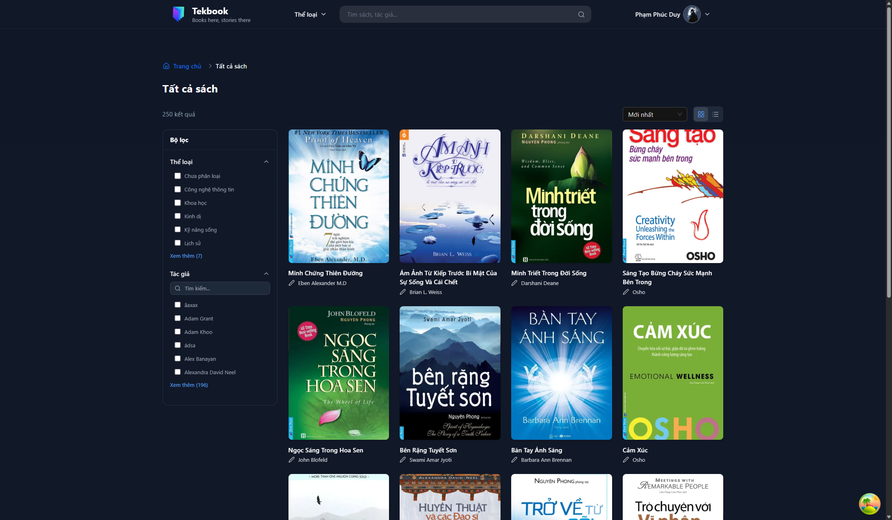
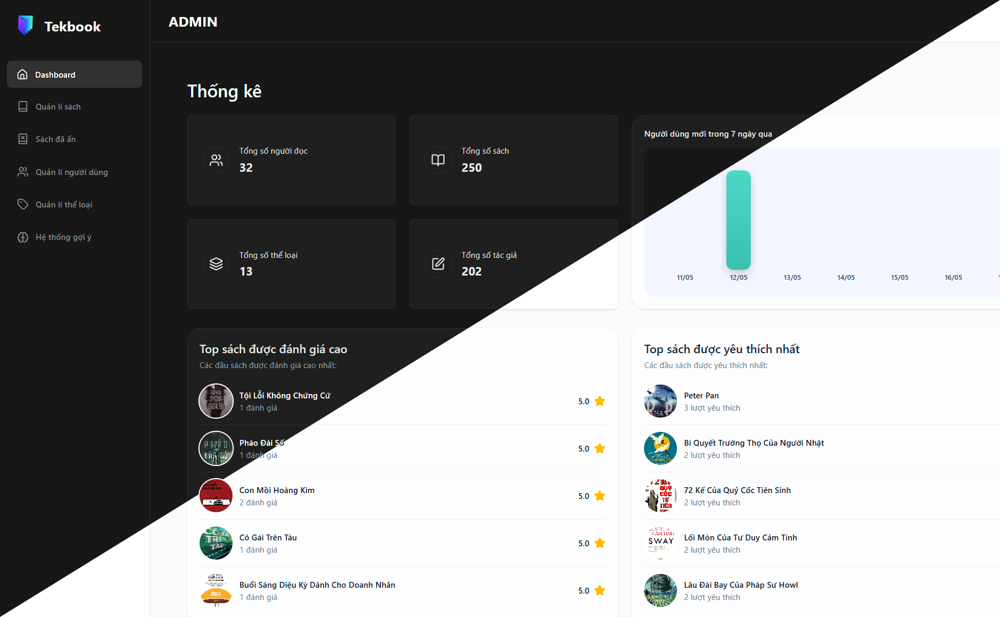

# TekBook — Book Recommendation System Frontend

## Abstract

TekBook is a full-featured, single-page web application that provides a personalized digital reading experience. The platform allows users to discover, read, and track books through an intelligent recommendation engine backed by ALS (Alternating Least Squares) collaborative filtering and SBERT (Sentence-BERT) semantic similarity models. The frontend is built on React 19 with Vite and communicates exclusively with a RESTful backend API, acting as a thin presentation layer with a strict separation of concerns between UI, data fetching, and business logic.

The application targets two distinct user roles: regular users who browse, read, and manage their reading history and favorites, and administrators who manage the catalog, monitor the recommendation engine, and control the platform's operational health.

---

## UI Screenshots

The screenshots below illustrate the primary screens of the application. To update this section, place your images inside a `docs/screenshots/` directory at the project root and replace the placeholder paths accordingly.

### User Interface

<table>
  <tr>
    <td align="center">
      
      <br/>
      <sub><b>Home — Personalized recommendations and featured books</b></sub>
    </td>
    <td align="center">
      
      <br/>
      <sub><b>All Books — Catalog browse with search and genre filters</b></sub>
    </td>
  </tr>
  <tr>
    <td align="center">
      
      <br/>
      <sub><b>Book Detail — Metadata, ratings, reviews, and similar books</b></sub>
    </td>
    <td align="center">
      
      <br/>
      <sub><b>Book Reader — Paginated EPUB viewer with bookmarks and TOC panel</b></sub>
    </td>
  </tr>
  <tr>
    <td align="center">
      
      <br/>
      <sub><b>Account — Profile, reading history, and favorites management</b></sub>
    </td>
    <td align="center">
      
      <br/>
      <sub><b>Dark Mode — System-level theme support across all pages</b></sub>
    </td>
  </tr>
</table>

### Admin Panel

<table>
  <tr>
    <td align="center">
      
      <br/>
      <sub><b>Dashboard — Platform analytics and key metrics</b></sub>
    </td>
    <td align="center">
      
      <br/>
      <sub><b>Books — Catalog management with add, edit, and soft-delete</b></sub>
    </td>
  </tr>
  <tr>
    <td align="center">
      
      <br/>
      <sub><b>Recommendation Engine — Model status, retrain controls, and Redis cache inspector</b></sub>
    </td>
    <td align="center">
      
      <br/>
      <sub><b>Users — User account management and role administration</b></sub>
    </td>
  </tr>
</table>

---

## Key Features

**User-Facing**
- Personalized book recommendations powered by server-side ALS collaborative filtering.
- SBERT-based semantic similarity for "You may also like" suggestions on book detail pages.
- In-browser EPUB reading via `epubjs` with paginated rendering, keyboard navigation, and responsive layout.
- Presigned URL delivery for secure, time-limited access to EPUB and PDF book assets.
- Reading progress tracking with a monotonic, debounced sync strategy (minimum delta threshold and 30-second interval) that prevents regressive writes.
- Per-book, per-user bookmark management (create, rename, delete) with optimistic UI updates via TanStack Query mutations.
- User favorites and reading history management with dedicated account sections.
- Light/Dark theme with FOUC (flash of unstyled content) prevention via an inline script in `index.html`.
- Google One Tap OAuth integration with a dedicated OAuth callback route.
- Account activation and password reset flows via tokenized email links.

**Authentication**
- Hybrid token architecture: short-lived JWT access token stored in `localStorage`, long-lived refresh token stored in an HttpOnly cookie managed exclusively by the backend.
- Automatic silent token refresh via an Axios response interceptor with a concurrent-request queue to prevent multiple simultaneous refresh calls (failed-queue pattern).
- Role-based route protection via `ProtectedRoute`, `AdminRoute`, and `UserRoute` guard components.

**Admin Panel**
- Dashboard with platform-level analytics rendered via Recharts.
- Full CRUD operations for the book catalog including multi-format upload, cover image management via Cloudinary, and soft-delete with a dedicated restoration view.
- Genre management.
- User management.
- Recommendation engine administration: model health monitoring, full retrain triggering, incremental online learning controls (enable/disable, buffer size configuration, manual update flush), Redis recommendation cache inspection and invalidation, and real-time model metadata display (ALS factors, SBERT dimensions, item counts).

---

## Tech Stack

| Category | Technology |
|---|---|
| Framework | React 19 |
| Build Tool | Vite 7 |
| Routing | React Router DOM v7 |
| Server State / Data Fetching | TanStack Query (React Query) v5 |
| HTTP Client | Axios |
| UI Component Library | Ant Design v5 (with React 19 compatibility patch) |
| Styling | Tailwind CSS v4 (Vite plugin integration) |
| Animation | Motion (Framer Motion successor) |
| Icons | Lucide React, React Icons |
| EPUB Rendering | epub.js |
| PDF Support | pdfjs-dist |
| Data Visualization | Recharts |
| Compiler Optimization | babel-plugin-react-compiler |
| Testing | Vitest, Testing Library (React, Jest DOM, User Event) |
| Linting | ESLint 9 (Flat Config) |
| Deployment | Vercel (SPA rewrite rules configured) |

---

## Prerequisites

- **Node.js**: v18.0.0 or later (v20 LTS recommended)
- **npm**: v9.0.0 or later (bundled with Node.js)

Verify your environment:

```bash
node --version
npm --version
```

---

## Installation and Setup

### 1. Clone the Repository

```bash
git clone <repository-url>
cd book-recommendation-system-frontend
```

### 2. Install Dependencies

```bash
npm install
```

### 3. Configure Environment Variables

Create a `.env` file in the project root by copying the example below. See the [Environment Variables](#environment-variables) section for details.

```bash
cp .env.example .env
```

Edit `.env` and populate all required values.

### 4. Start the Development Server

```bash
npm run dev
```

The application will be available at `http://localhost:5173` by default. The dev server is also bound to `--host`, making it accessible on the local network.

### Additional Scripts

| Command | Description |
|---|---|
| `npm run build` | Compile and bundle the application for production output to `dist/` |
| `npm run preview` | Serve the production build locally for verification |
| `npm run lint` | Run ESLint across all source files |
| `npm run test` | Execute the Vitest test suite |

---

## Environment Variables

The following variables must be defined in a `.env` file at the project root. All variables are prefixed with `VITE_` and are statically injected at build time by Vite; they are therefore visible in the compiled client bundle. Do not store server-side secrets in this file.

| Variable | Required | Description |
|---|---|---|
| `VITE_API_BASE_URL` | Yes | The base URL of the backend REST API. Used by the Axios instance for all API calls during local development. Example: `http://localhost:8080/api/v1` |
| `VITE_API_BASE_FRONTEND` | Yes | The publicly accessible frontend URL, used to construct proxied API routes in production. Example: `https://your-domain.com/api` |
| `VITE_GOOGLE_CLIENT_ID` | Yes | The OAuth 2.0 Client ID from Google Cloud Console. Required for Google One Tap sign-in. |

**Production note**: In the Vercel deployment, all API traffic is expected to pass through a proxy configured on the same origin as the frontend to ensure HttpOnly cookies are sent as first-party cookies. `VITE_API_BASE_FRONTEND` should point to this proxied endpoint.

---

## Project Structure

```
src/
├── App.jsx                  # Root component: provider composition and route declarations
├── main.jsx                 # Application entry point; mounts React into the DOM
│
├── config/
│   └── ApiConfig.js         # Axios instance, request/response interceptors, token refresh logic
│
├── constants/
│   ├── routePaths.js        # Centralized route path definitions (PATHS object)
│   └── homeGenres.js        # Static genre configuration for the home page
│
├── contexts/
│   ├── Auth/                # Authentication context and provider (user state, login, logout, register)
│   ├── Genre/               # Global genre list context and provider
│   ├── Message/             # Ant Design message API context
│   └── Theme/               # Light/dark theme context and provider
│
├── hooks/
│   ├── useAuth.jsx          # Consumes AuthContext
│   ├── useEpubReader.jsx    # Core EPUB lifecycle: initialization, navigation, CFI persistence
│   ├── useEpubTheme.jsx     # EPUB reader theme registration and application
│   ├── useReadingProgress.jsx  # Monotonic, debounced reading progress sync to backend
│   ├── useBookmarks.jsx     # Bookmark CRUD with optimistic updates via TanStack Query
│   ├── useBookDetail.jsx    # Book detail data fetching and state
│   ├── useBookReaderData.jsx # Presigned URL fetching for the reader
│   ├── useBookReviews.jsx   # Book rating and review management
│   ├── useFavorite.jsx      # Favorite toggle and state
│   ├── useRecommendedBooks.jsx # Personalized recommendation fetching
│   ├── useSimilarBooks.jsx  # SBERT-based similar book fetching
│   ├── useSameGenreBooks.jsx # Same-genre book list fetching
│   ├── useTopBooks.jsx      # Most-read books fetching
│   ├── useGenres.jsx        # Consumes GenreContext
│   ├── useGenreMap.jsx      # Genre ID-to-name mapping utility
│   ├── useLazyLoadGenres.jsx # Lazy-loaded genre list with intersection observer
│   ├── useMessage.jsx       # Consumes MessageContext
│   └── useTheme.jsx         # Consumes ThemeContext
│
├── services/
│   ├── authService.js       # Auth API calls (login, register, logout, refresh, activate, reset)
│   ├── bookService.js       # Book catalog API calls (list, detail, read URL, download URL)
│   ├── bookmarkService.js   # Bookmark CRUD API calls
│   ├── dashboardService.js  # Admin dashboard statistics API calls
│   ├── favoriteService.js   # Favorite add/remove/check API calls
│   ├── genreService.js      # Genre list and management API calls
│   ├── historyService.js    # Reading history and progress API calls
│   ├── manageBookService.js # Admin book management API calls (CRUD, restore)
│   ├── manageUserService.js # Admin user management API calls
│   ├── ratingService.js     # Book rating and review API calls
│   ├── recommendationService.js # Recommendation engine API calls (user + admin)
│   ├── authorService.js     # Author data API calls
│   └── userService.js       # User profile API calls
│
├── components/
│   ├── routes/              # Route guard components (ProtectedRoute, AdminRoute, UserRoute)
│   ├── auth/                # Login, register, and OAuth modal components
│   ├── header/              # Application header and navigation
│   ├── home/                # Home page section components
│   ├── book-detail/         # Book detail page components (info, reviews, ratings)
│   ├── AllBooks/            # Book catalog listing and filter components
│   ├── account/             # User account section components
│   ├── admin/               # Admin panel shared components
│   ├── reader/              # EPUB reader UI sub-components (header, controls, side panel)
│   └── common/              # Shared, reusable UI primitives
│
├── pages/
│   ├── Home.jsx             # Home page
│   ├── BookDetail.jsx       # Book detail page
│   ├── AllBooks.jsx         # Full catalog browse page with search and filters
│   ├── CategoryBooks.jsx    # Genre-filtered book listing
│   ├── About.jsx            # About page
│   ├── NotFound.jsx         # 404 page
│   ├── Auth/                # OAuthRedirect, ActivateAccount, ResetPassword pages
│   ├── BookReader/          # EPUB reader page (BookReader.jsx, ReaderHeader, ReaderControls, SidePanel)
│   ├── ManageAccount/       # User account management (profile, favorites, reading history)
│   └── Admin/               # Admin pages (Dashboard, Users, Books, AddBook, EditBook, Genres, Recommendation)
│
├── layouts/
│   ├── MainLayout.jsx       # Standard page layout with header and footer
│   └── AdminLayout.jsx      # Admin panel layout
│
└── utils/
    ├── storage.js           # localStorage helpers for access token management
    ├── cloudinaryUtils.js   # Cloudinary image upload utilities
    ├── validatorInput.js    # Form input validation helpers
    ├── generateSlug.js      # URL slug generation utility
    └── cache.utils.js       # Client-side cache utilities
```

---

## Authentication Architecture

The application uses a dual-token authentication scheme:

- **Access Token**: A short-lived JWT stored in `localStorage` under the key `access_token`. Attached to every outbound API request as a `Bearer` token via an Axios request interceptor.
- **Refresh Token**: A long-lived token stored in an HttpOnly cookie, set and managed exclusively by the backend. It is never accessible to JavaScript.

When a 401 response is received on a non-auth endpoint, the Axios response interceptor automatically issues a single `POST /auth/refresh` request. All other in-flight requests are held in a queue and replayed with the new token upon a successful refresh. If the refresh itself fails with a 401 or 403, local auth data is cleared and the user is treated as unauthenticated.

---

## Deployment

The application is configured for deployment on Vercel. The `vercel.json` file contains a catch-all SPA rewrite rule that redirects all routes to `index.html`, enabling client-side routing to function correctly on direct URL access or page refresh.

```json
{
  "rewrites": [
    { "source": "/(.*)", "destination": "/index.html" }
  ]
}
```

To produce a production build locally:

```bash
npm run build
```

The output is placed in the `dist/` directory and can be served by any static hosting provider.
