# TekBook — User Interface & Screenshots

The screenshots below illustrate the primary screens of the application.

---

## User Interface

### 1. Home Page
> **Discover featured books and personalized recommendations**

> **Extended home page interface**

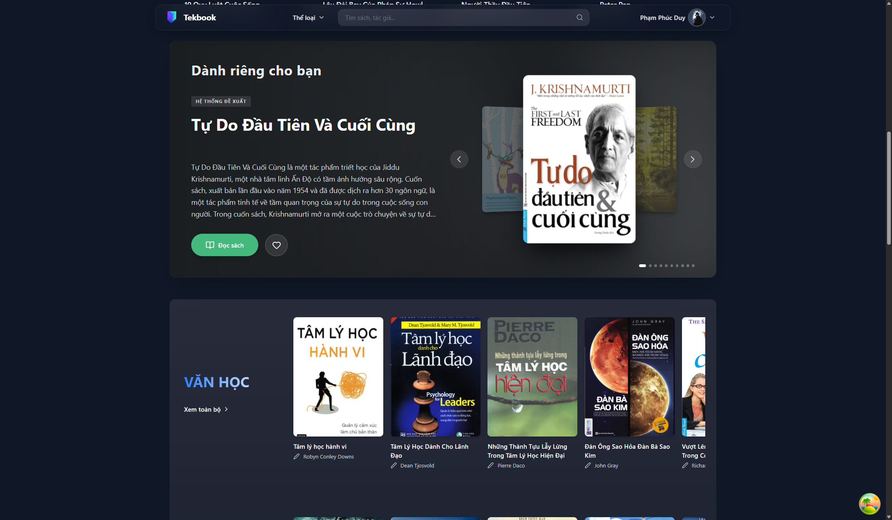

> **Search interface**

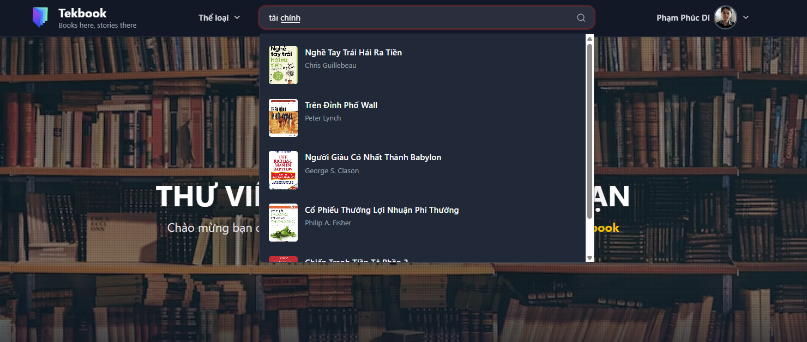

### 2. Book Detail
> **Book metadata, ratings, and similar books**

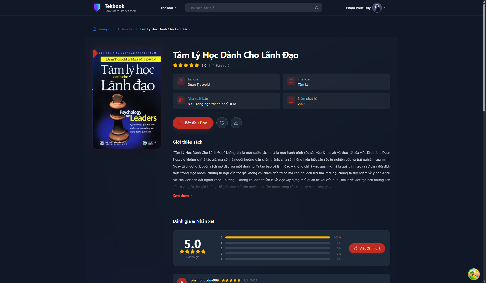

> **Detailed reader ratings and reviews**

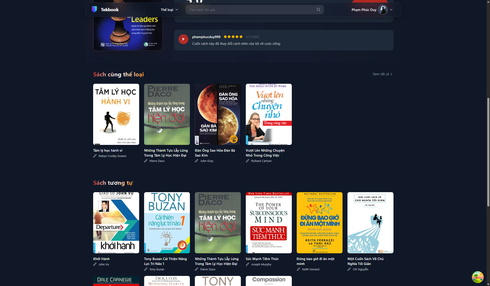

### 3. Library & Categories
> **Book Category — Explore books by categories and genres**

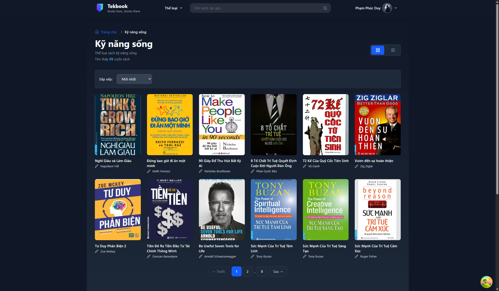

> **All Books — Comprehensive library with filters and pagination**

### 4. Reading Experience
> **Book Reader — Optimized EPUB reader with display customizations**

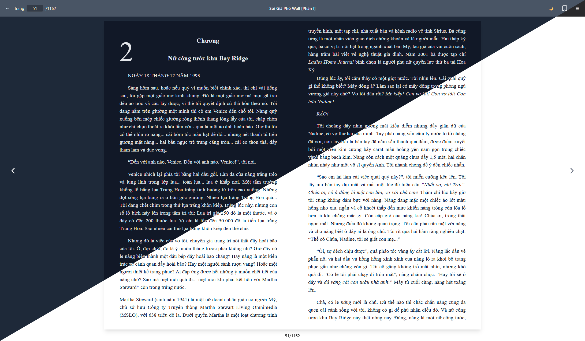

> **Table of Contents — Quick navigation between chapters**

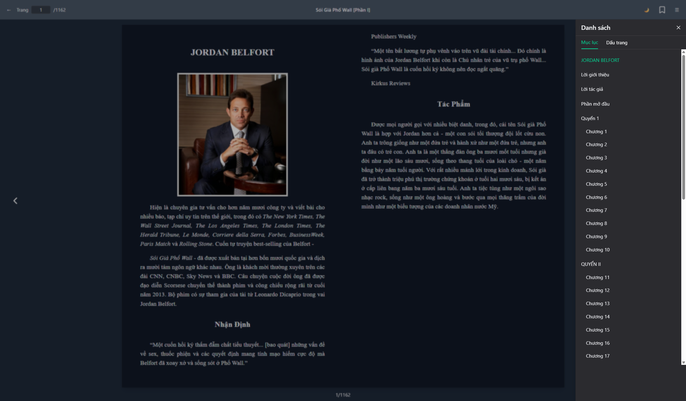

> **Bookmarks — Manage saved bookmarks and highlights**

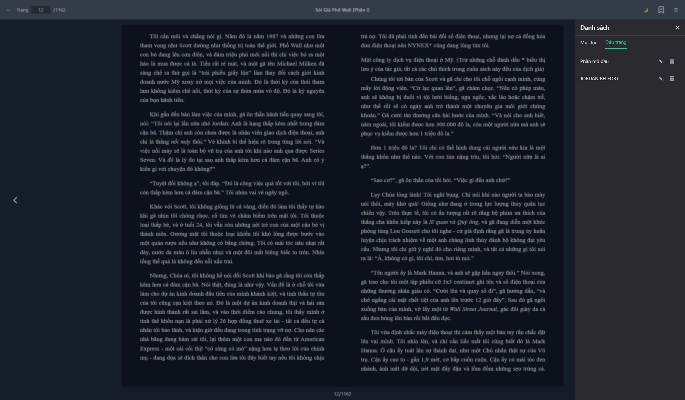

### 5. User Account & Authentication
> **Account — Account settings and personal information management**

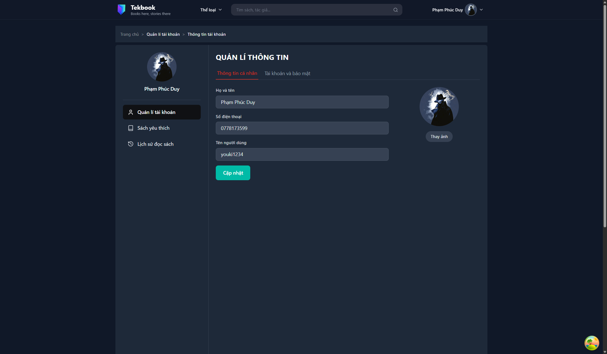

> **Favorites — List of saved favorite books**

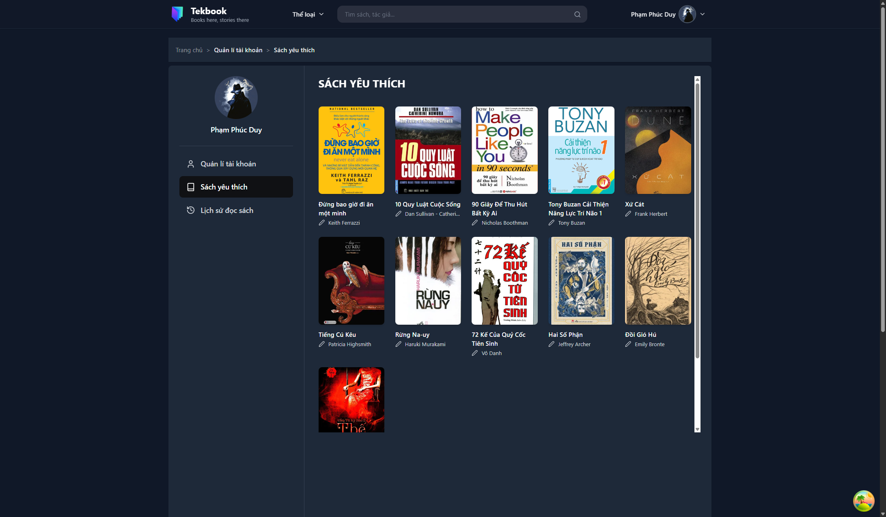

> **History — Recent reading history and progress**

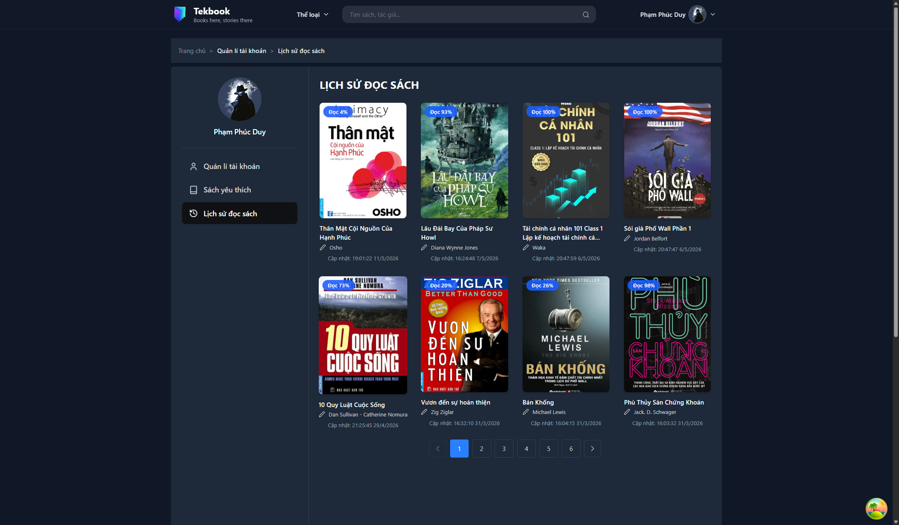

> **Authentication — Secure login and registration interface**

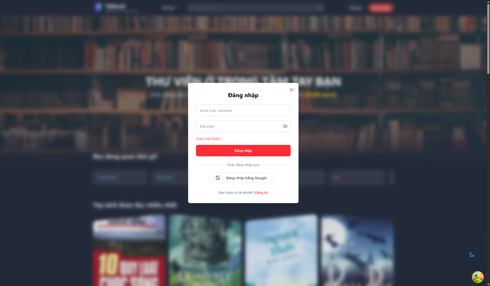

---

## Admin Panel

### 1. Dashboard
> **Overview of platform statistics, activity, and analytics**

### 2. Book Management
> **Manage book catalog, metadata, and library content**

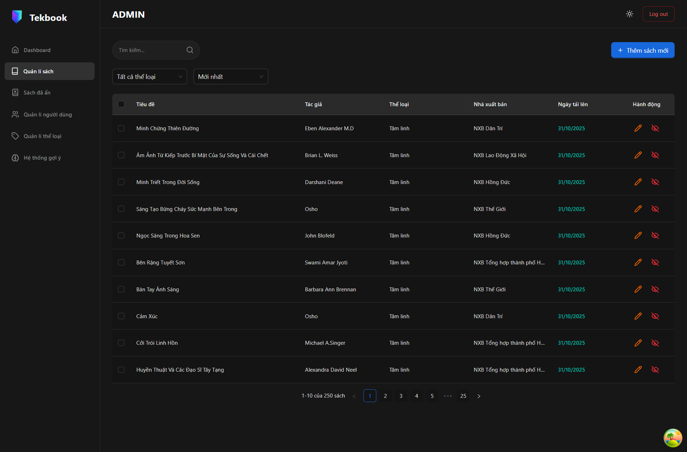

> **Add Book — Upload and publish new books to the platform**

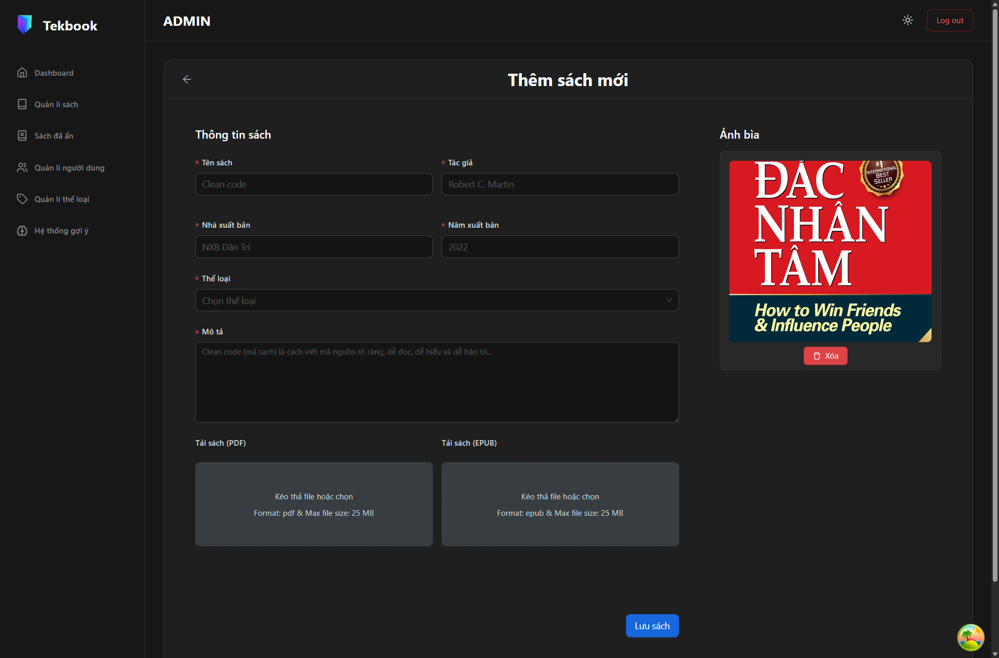

### 3. System & Users
> **Category Management — Organize and manage book genres and categories**

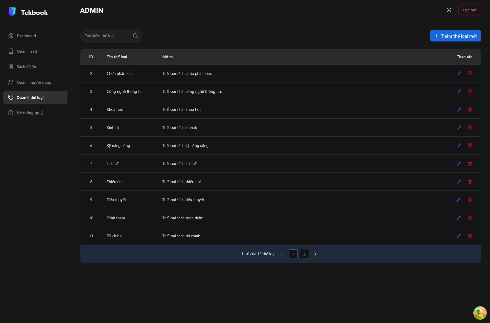

> **User Management — Manage user accounts**

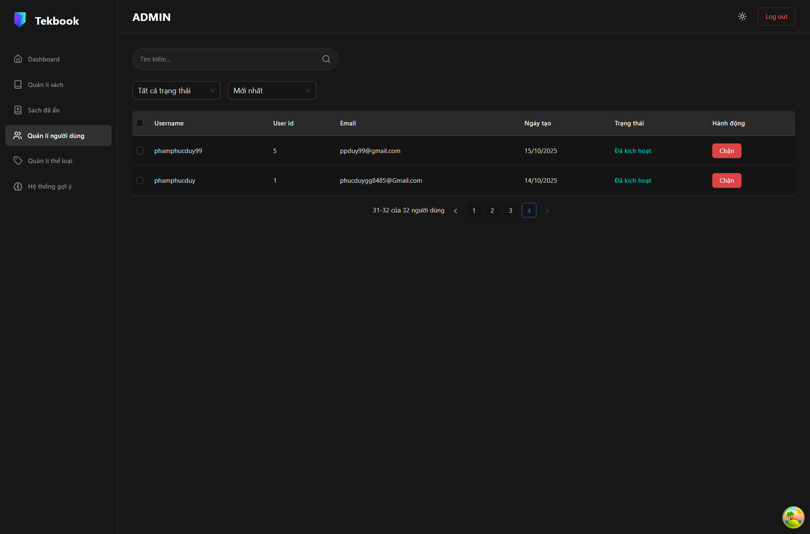

> **Recommendation System — Configure and monitor personalized book recommendations**

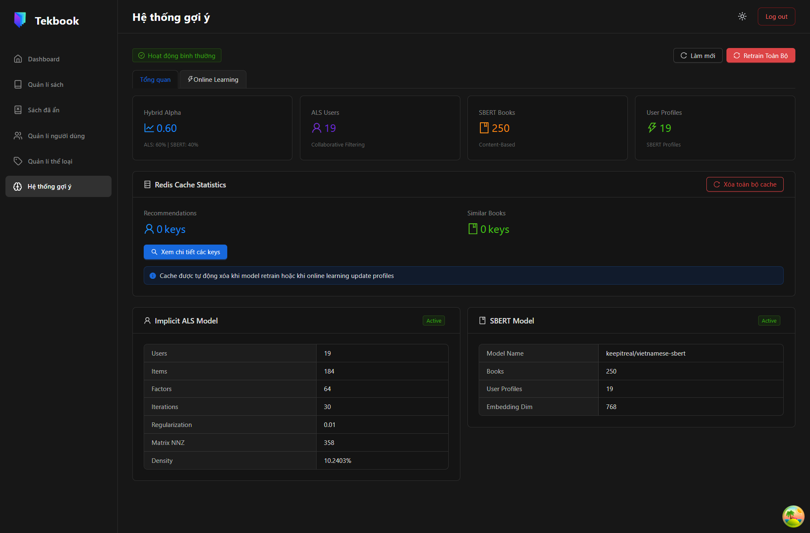